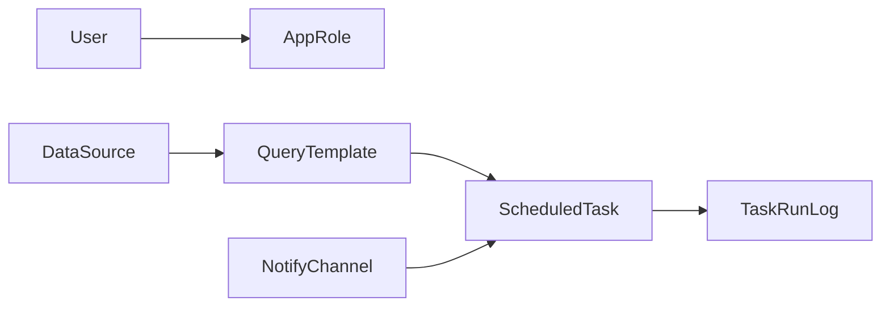

# Message Center 数据库结构文档

> 数据库：PostgreSQL
> 
> ORM：Prisma
> 
> 生成时间：2026-06-02

## 1. 文档范围

本文件仅保留与当前消息中心系统直接相关的数据模型：
- 用户与角色
- 数据源与查询模板
- 通知通道
- 调度任务与执行日志

## 2. 用户与角色

### 2.1 User（用户）

**表名**：User

| 字段名 | 类型 | 必填 | 默认值 | 说明 |
|---|---|---|---|---|
| id | String(UUID) | 是 | 自动生成 | 主键 |
| username | String | 是 | - | 登录账号，唯一 |
| name | String | 是 | - | 用户名 |
| email | String | 否 | - | 邮箱 |
| phone | String | 否 | - | 手机号 |
| department | String | 否 | - | 部门 |
| passwordHash | String | 是 | - | 密码哈希 |
| role | String | 是 | ROLE_BUYER | 角色编码 |
| status | String | 是 | ACTIVE | 状态 |
| createdAt | DateTime | 是 | now() | 创建时间 |
| updatedAt | DateTime | 是 | @updatedAt | 更新时间 |

### 2.2 AppRole（角色）

**表名**：AppRole

| 字段名 | 类型 | 必填 | 默认值 | 说明 |
|---|---|---|---|---|
| id | String | 是 | - | 角色编码（主键） |
| name | String | 是 | - | 角色名称 |
| description | String | 否 | - | 角色描述 |
| permissionJson | String | 否 | - | 权限 JSON |
| createdAt | DateTime | 是 | now() | 创建时间 |
| updatedAt | DateTime | 是 | @updatedAt | 更新时间 |

## 3. 消息中心核心模型

### 3.1 DataSource（数据源）

**表名**：DataSource

| 字段名 | 类型 | 必填 | 默认值 | 说明 |
|---|---|---|---|---|
| id | String(UUID) | 是 | 自动生成 | 主键 |
| name | String | 是 | - | 数据源名称，唯一 |
| type | String | 是 | - | POSTGRESQL/MYSQL/MSSQL |
| host | String | 是 | - | 主机 |
| port | Int | 是 | - | 端口 |
| database | String | 是 | - | 数据库名 |
| username | String | 是 | - | 用户名 |
| password | String | 是 | - | 密码 |
| schema | String | 否 | - | schema |
| description | String | 否 | - | 描述 |
| status | String | 是 | ACTIVE | 状态 |
| createdAt | DateTime | 是 | now() | 创建时间 |
| updatedAt | DateTime | 是 | @updatedAt | 更新时间 |

### 3.2 QueryTemplate（查询模板）

**表名**：QueryTemplate

| 字段名 | 类型 | 必填 | 默认值 | 说明 |
|---|---|---|---|---|
| id | String(UUID) | 是 | 自动生成 | 主键 |
| name | String | 是 | - | 模板名称 |
| dataSourceId | String | 是 | - | 外键 -> DataSource.id |
| sql | String | 是 | - | SQL 模板 |
| columnsJson | String | 否 | - | 列配置 JSON |
| messageTemplate | String | 否 | - | 消息模板 |
| description | String | 否 | - | 描述 |
| status | String | 是 | ACTIVE | 状态 |
| createdAt | DateTime | 是 | now() | 创建时间 |
| updatedAt | DateTime | 是 | @updatedAt | 更新时间 |

索引：dataSourceId

### 3.3 NotifyChannel（通知通道）

**表名**：NotifyChannel

| 字段名 | 类型 | 必填 | 默认值 | 说明 |
|---|---|---|---|---|
| id | String(UUID) | 是 | 自动生成 | 主键 |
| name | String | 是 | - | 通道名称，唯一 |
| type | String | 是 | - | EMAIL/DINGTALK/WECOM |
| configJson | String | 是 | - | 通道配置 JSON |
| description | String | 否 | - | 描述 |
| status | String | 是 | ACTIVE | 状态 |
| createdAt | DateTime | 是 | now() | 创建时间 |
| updatedAt | DateTime | 是 | @updatedAt | 更新时间 |

### 3.4 ScheduledTask（调度任务）

**表名**：ScheduledTask

| 字段名 | 类型 | 必填 | 默认值 | 说明 |
|---|---|---|---|---|
| id | String(UUID) | 是 | 自动生成 | 主键 |
| name | String | 是 | - | 任务名，唯一 |
| cronExpr | String | 是 | - | Cron 表达式 |
| queryTemplateId | String | 是 | - | 外键 -> QueryTemplate.id |
| channelId | String | 是 | - | 外键 -> NotifyChannel.id |
| recipients | String | 是 | - | 收件人，逗号分隔 |
| messageTitle | String | 否 | - | 消息标题 |
| status | String | 是 | ACTIVE | ACTIVE/PAUSED |
| lastRunAt | DateTime | 否 | - | 最近执行时间 |
| lastRunStatus | String | 否 | - | SUCCESS/FAILED |
| nextRunAt | DateTime | 否 | - | 下次执行时间 |
| createdAt | DateTime | 是 | now() | 创建时间 |
| updatedAt | DateTime | 是 | @updatedAt | 更新时间 |

索引：queryTemplateId, channelId

### 3.5 TaskRunLog（任务执行日志）

**表名**：TaskRunLog

| 字段名 | 类型 | 必填 | 默认值 | 说明 |
|---|---|---|---|---|
| id | String(UUID) | 是 | 自动生成 | 主键 |
| taskId | String | 是 | - | 外键 -> ScheduledTask.id（级联删除） |
| status | String | 是 | - | SUCCESS/FAILED |
| rowCount | Int | 否 | - | 结果行数 |
| message | String | 否 | - | 执行信息 |
| content | String | 否 | - | 通知内容摘要 |
| startedAt | DateTime | 是 | - | 开始时间 |
| finishedAt | DateTime | 否 | - | 结束时间 |
| createdAt | DateTime | 是 | now() | 创建时间 |

索引：(taskId, createdAt)

## 4. 表关系总览

主要外键：
- QueryTemplate.dataSourceId -> DataSource.id
- ScheduledTask.queryTemplateId -> QueryTemplate.id
- ScheduledTask.channelId -> NotifyChannel.id
- TaskRunLog.taskId -> ScheduledTask.id

## 5. 枚举值

- DataSource.type: POSTGRESQL, MYSQL, MSSQL
- NotifyChannel.type: EMAIL, DINGTALK, WECOM
- ScheduledTask.status: ACTIVE, PAUSED
- ScheduledTask.lastRunStatus: SUCCESS, FAILED

## 6. 说明

本文件已移除历史复制的无关业务域数据结构，仅保留消息中心当前使用的数据模型。
