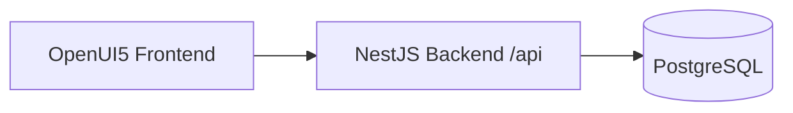
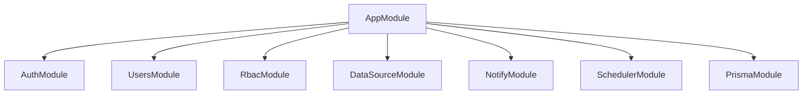

# Message Center 技术栈总览

## 1. 系统定位

Message Center 是一个面向运维与业务通知的消息中心系统，核心能力包括：
- 多数据源接入
- 查询模板管理
- 多通道通知发送
- 定时任务调度与执行日志
- 用户与角色权限控制

## 2. 架构概览

## 3. 前端技术栈（ui5-message-center）

- OpenUI5（sap.m / sap.ui.core）
- JavaScript（UI5 模块化）
- UI5 Tooling（@ui5/cli）
- 开发代理（ui5-middleware-simpleproxy）

关键能力：
- 统一 API 客户端
- 自动附加 Bearer Token
- 401 自动 refresh 并重试

## 4. 后端技术栈（message-center-backend）

- NestJS 11
- TypeScript 5
- Prisma ORM
- PostgreSQL 16
- JWT + bcryptjs

全局基础能力：
- 全局路由前缀 /api
- 全局 ValidationPipe（whitelist + transform + forbidNonWhitelisted）
- 全局 HttpExceptionFilter
- 全局 JWT Guard
- Public 装饰器放行公开接口

## 5. 后端模块边界

模块职责：
- AuthModule：登录与令牌刷新
- UsersModule：用户账号管理
- RbacModule：角色和菜单权限
- DataSourceModule：数据源与查询模板
- NotifyModule：通知通道管理与测试发送
- SchedulerModule：定时任务执行、手动执行、日志查询

## 6. 数据模型范围

当前消息中心主模型：
- User, AppRole
- DataSource, QueryTemplate
- NotifyChannel
- ScheduledTask, TaskRunLog

## 7. 工程化与运行

- 代码质量：ESLint + Prettier
- 测试：Jest
- 构建：Nest build + UI5 build
- 依赖服务：Docker Compose（PostgreSQL）

常用命令：
- 后端开发：npm run start:dev
- 后端构建：npm run build
- 前端开发：npm --prefix ..\\ui5-message-center run start
- 数据库启动：npm run db:up

## 8. 文档范围说明

本文件只描述当前消息中心系统内容，已移除历史复制的无关采购业务域说明。
